# ☁️ AWS Lambda & API Gateway
## Java-Based Microservices on Serverless Infrastructure

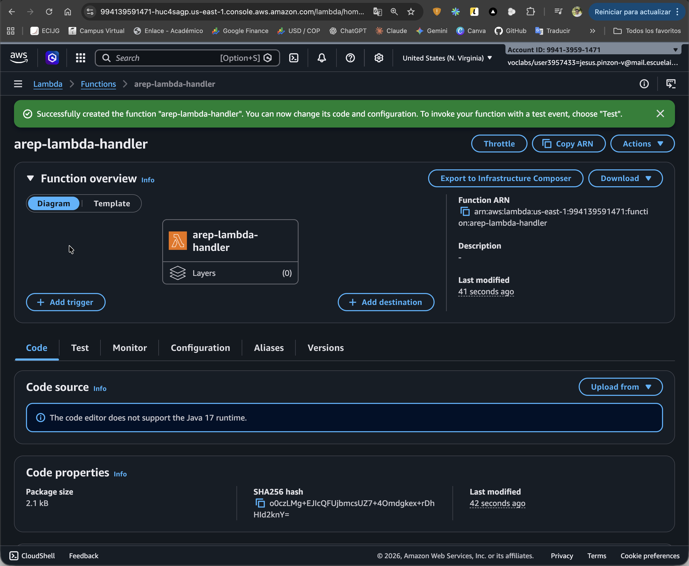

[](https://www.oracle.com/java/)
[](https://maven.apache.org/)
[](https://aws.amazon.com/lambda/)
[](https://aws.amazon.com/api-gateway/)
[](https://junit.org/junit5/)
[](LICENSE)

> **Enterprise Architecture (AREP)** — Homework 4
> Deploying Java microservices on **AWS Lambda** and exposing them through **AWS API Gateway** with REST endpoints for mathematical operations and user management.

---

## 📋 **Table of Contents**

- [Overview](#-overview)
- [Project Structure](#-project-structure)
- [Architecture](#-architecture)
- [API Endpoints](#-api-endpoints)
- [Getting Started](#-getting-started)
- [AWS Lambda Deployment](#-aws-lambda-deployment)
- [AWS API Gateway Configuration](#-aws-api-gateway-configuration)
- [Testing](#-testing)
- [Author](#-author)
- [License](#-license)
- [Additional Resources](#-additional-resources)

---

## 🌐 **Overview**

This project demonstrates the deployment of a **serverless Java application** using **AWS Lambda** and **AWS API Gateway**. A single Lambda function routes incoming requests to specialized service classes based on query parameters or request body fields, implementing three operations:

- 🔢 **Square of a number** — GET endpoint with a numeric query parameter
- 👋 **Greeting message** — GET endpoint with a name query parameter
- 👤 **Create user** — POST endpoint that returns the submitted user data as a JSON object

The project applies **SOLID**, **DRY**, **KISS**, and **YAGNI** principles throughout its layered design, keeping business logic independent from AWS infrastructure concerns.

---

## 📁 **Project Structure**

```
AREP-homework-4-aws-lambda-and-api-gateway/
│
├── assets/
│   ├── docs/
│   └── images/
│
├── src/
│   ├── main/
│   │   └── java/
│   │       └── edu/eci/arep/
│   │           ├── handler/
│   │           │   └── LambdaHandler.java       # AWS Lambda entry point
│   │           └── service/
│   │               ├── GreetingService.java     # Greeting logic
│   │               ├── MathService.java         # Math computations
│   │               └── UserService.java         # User data processing
│   └── test/
│       └── java/
│           └── edu/eci/arep/
│               ├── handler/
│               │   └── LambdaHandlerTest.java
│               └── service/
│                   ├── GreetingServiceTest.java
│                   ├── MathServiceTest.java
│                   └── UserServiceTest.java
│
├── .gitignore
├── LICENSE
├── pom.xml
└── README.md
```

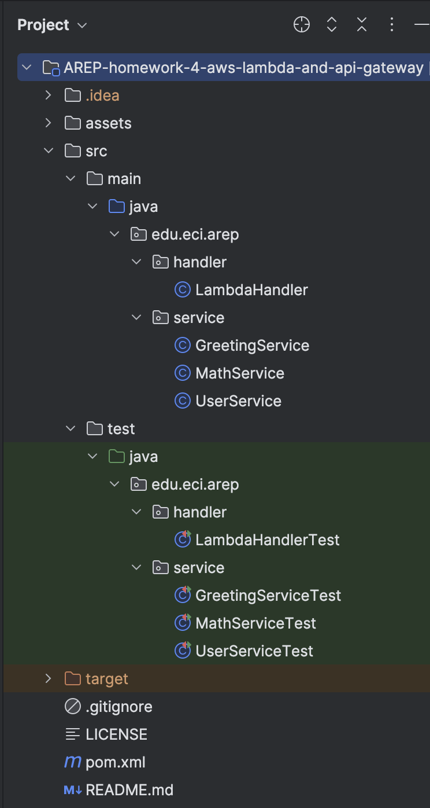

*Project structure as seen in IntelliJ IDEA*

---

## 🏛️ **Architecture**

The application follows a **layered serverless architecture**:

| Layer | Component | Responsibility |
|-------|-----------|----------------|
| **Entry Point** | `LambdaHandler` | Receives AWS events, routes by `action` key |
| **Service** | `MathService`, `GreetingService`, `UserService` | Pure business logic, no AWS dependencies |
| **Infrastructure** | AWS Lambda + API Gateway | Runtime, routing, and public exposure |

The **mapping templates** in API Gateway translate HTTP query parameters and JSON body fields into a flat `Map<String, Object>` consumed by the Lambda handler, keeping the Java code decoupled from HTTP concerns.

---

## 🔌 **API Endpoints**

| Method | Path | Query Parameters / Body | Description |
|--------|------|------------------------|-------------|
| `GET` | `/production` | `action=square&value={n}` | Returns the square of `n` |
| `GET` | `/production` | `action=greet&name={name}` | Returns a JSON greeting |
| `POST` | `/production/users` | `{"name": "...", "email": "..."}` | Returns the submitted user as JSON |

---

## 🚀 **Getting Started**

### Prerequisites

- **Java 17**
- **Maven 3.9+**
- **IntelliJ IDEA** (recommended)
- An active **AWS Academy** or standard AWS account

### Generate Project Structure

```bash
mvn archetype:generate \
  -DgroupId=edu.eci.arep \
  -DartifactId=aws-lambda-and-api-gateway \
  -Dpackage=edu.eci.arep \
  -DarchetypeArtifactId=maven-archetype-quickstart \
  -DinteractiveMode=false
```

### Build the Fat JAR

```bash
mvn clean package
```

The `maven-shade-plugin` produces a fat JAR at:

```
target/aws-lambda-and-api-gateway-1.0-SNAPSHOT.jar
```

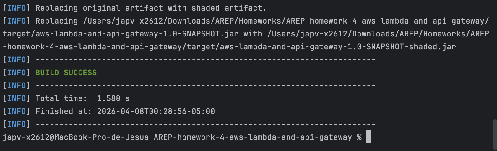

*Terminal showing a successful `mvn clean package` build*

---

## ☁️ **AWS Lambda Deployment**

### Step 1 — Create the Lambda Function

1. Open the **AWS Lambda** console
2. Click **Create function** → **Author from scratch**
3. Set the following configuration:
    - **Function name:** `arep-lambda-handler`
    - **Runtime:** Java 17
    - **Architecture:** x86_64
    - **Execution role:** `LabRole` (AWS Academy)
4. Click **Create function**

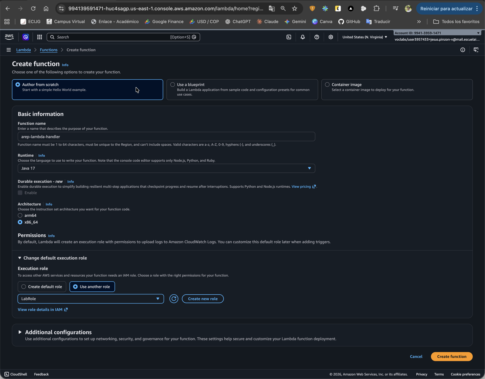

*Lambda function creation form with all required fields filled in*


*Confirmation screen after the Lambda function is successfully created*

### Step 2 — Upload the JAR

1. In the **Code** tab, click **Upload from** → **.zip or .jar file**
2. Select `target/aws-lambda-and-api-gateway-1.0-SNAPSHOT.jar`
3. Click **Save**

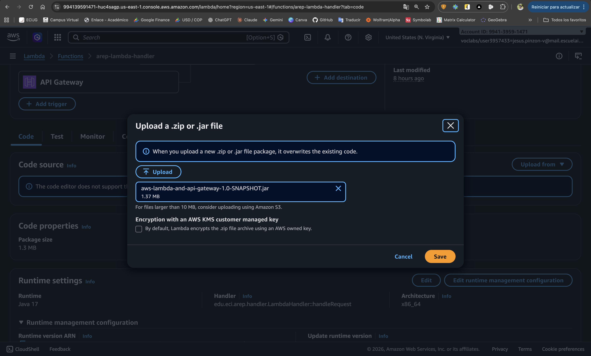

*Upload dialog showing the fat JAR selected and ready to be saved*

### Step 3 — Configure the Handler

1. In the **Code** tab, scroll to **Runtime settings** → click **Edit**
2. Set the **Handler** field to:

```
edu.eci.arep.handler.LambdaHandler::handleRequest
```

3. Click **Save**

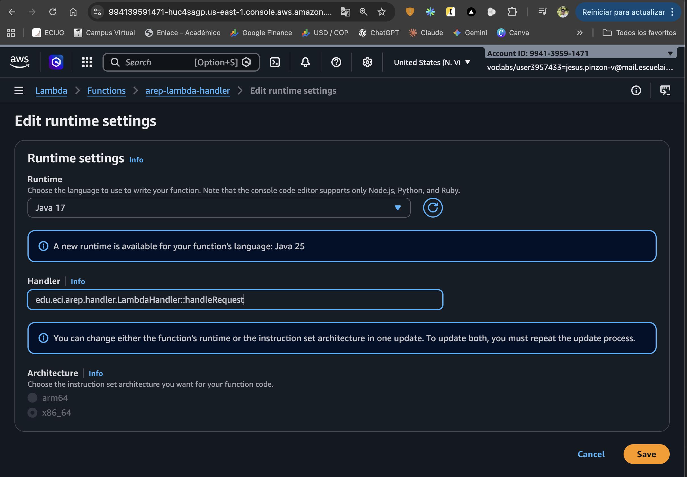

*Runtime settings editor with the correct fully-qualified handler path*

### Step 4 — Create Test Events

Navigate to the **Test** tab and create the following saved events:

**`testGreet`**
```json
{
  "action": "greet",
  "name": "AREP"
}
```

**`testSquare`**
```json
{
  "action": "square",
  "value": "5"
}
```

**`testCreateUser`**
```json
{
  "action": "user",
  "name": "Jesús Pinzón",
  "email": "jesus.pinzon-v@mail.escuelaing.edu.co"
}
```

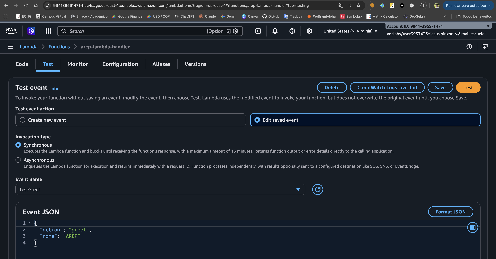

*Test event `testGreet` configured with action and name fields*


*Test event `testSquare` configured with action and value fields*

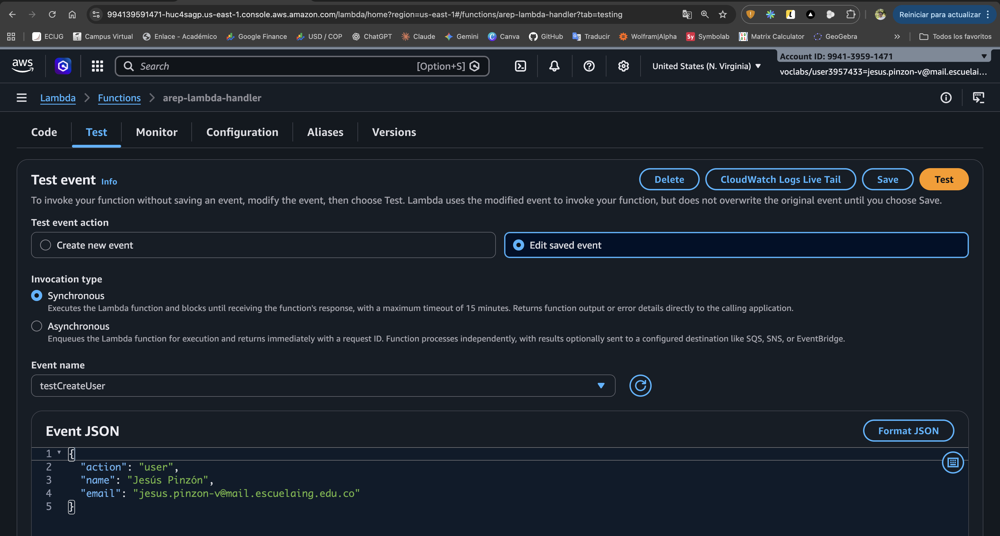

*Test event `testCreateUser` configured with action, name, and email fields*

### Step 5 — Execute the Test Events

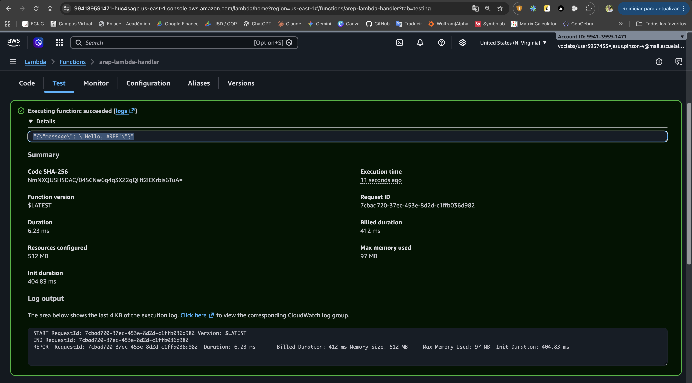

*Greeting test returning* `{"message": "Hello, AREP!"}` *with status succeeded*

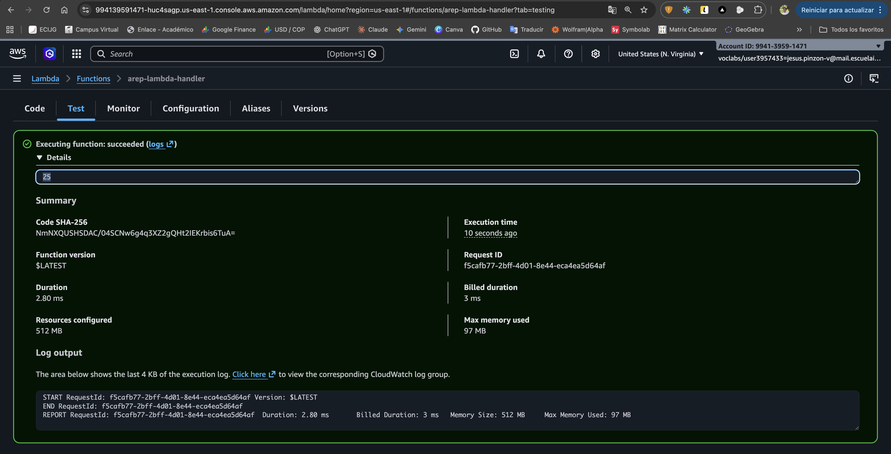

*Square test returning* `25` *for input value* `5`

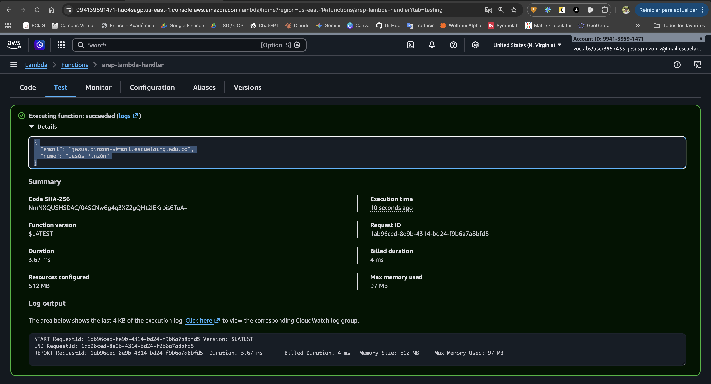

*User creation test returning a clean JSON object with name and email*

---

## 🔗 **AWS API Gateway Configuration**

### Step 1 — Create the REST API

1. Open **API Gateway** → **Create API** → **REST API** → **New API**
2. Set:
    - **API name:** `arep-math-greeting-api`
    - **Description:** Math API
    - **Endpoint type:** Regional
3. Click **Create API**

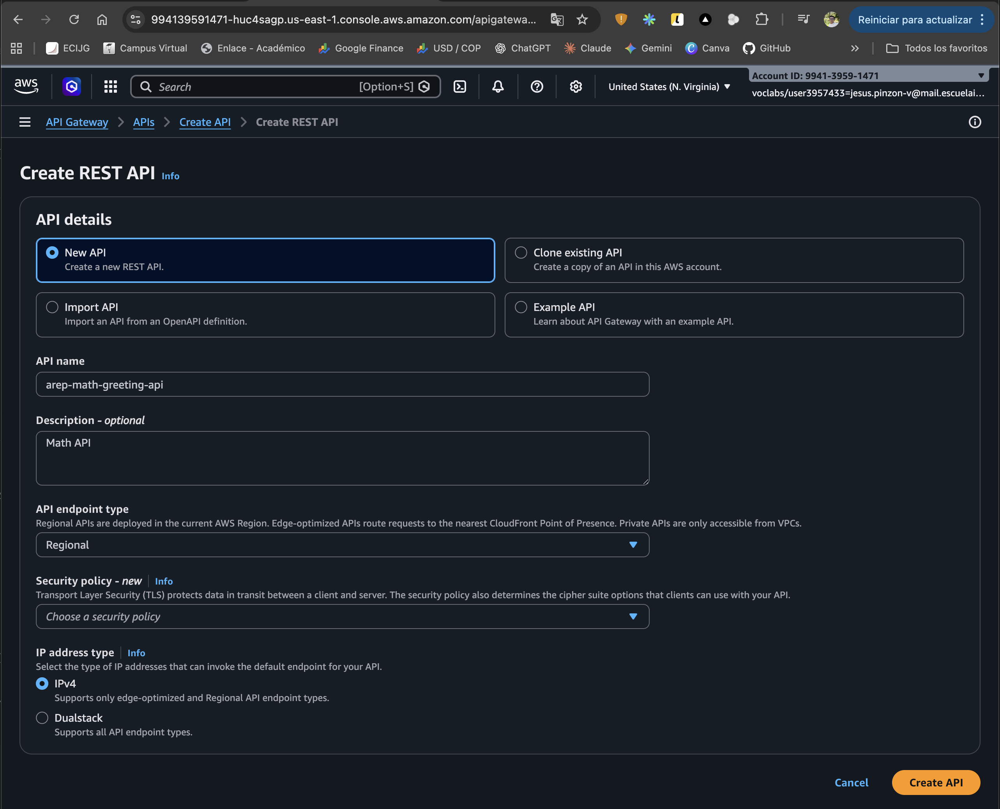

*REST API creation form with name, description, and Regional endpoint type*

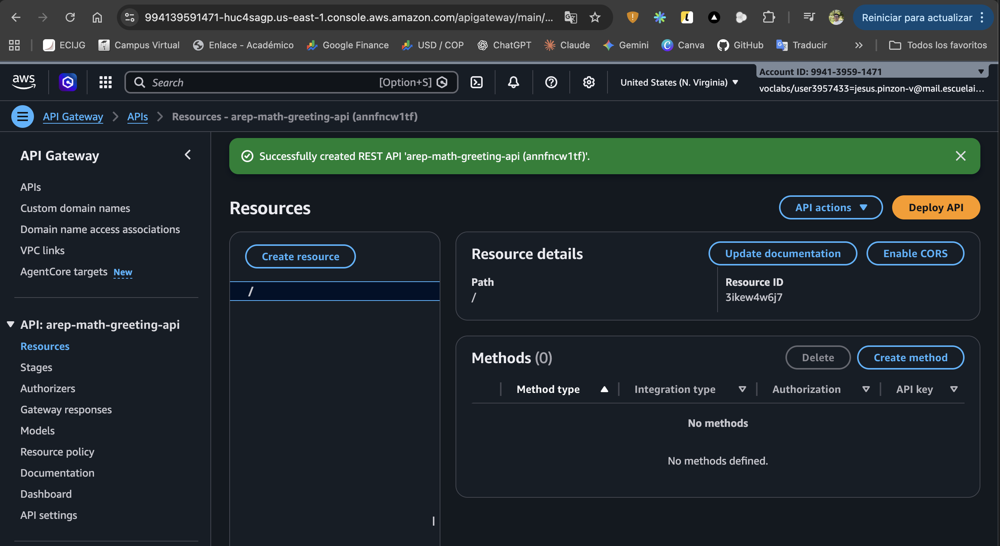

*API Gateway resources panel after successful creation*

### Step 2 — Configure the GET Method on `/`

1. With `/` selected, click **Create method** → **GET**
2. Set **Integration type** to **Lambda Function** and select `arep-lambda-handler`
3. Click **Save**

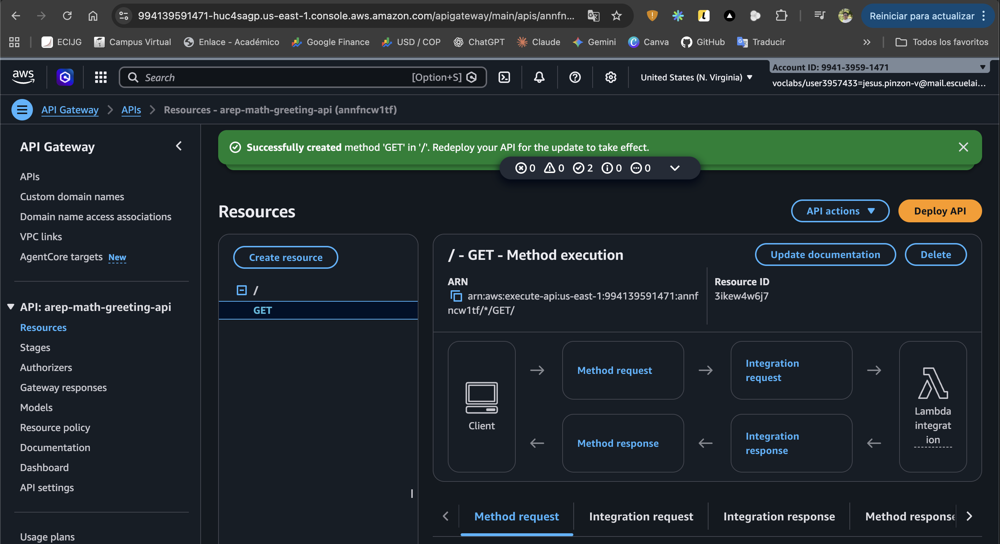

*GET method execution panel showing Lambda integration and method flow diagram*

### Step 3 — Configure the POST Method on `/users`

1. Click **Create resource** → set path to `/users`, enable CORS → **Create resource**
2. With `/users` selected, click **Create method** → **POST**
3. Set **Integration type** to **Lambda Function** and select `arep-lambda-handler`
4. Click **Save**

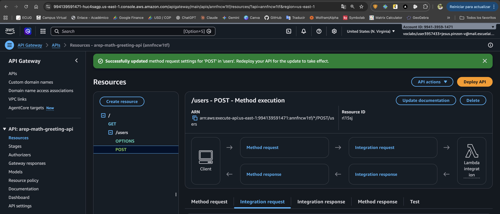

*POST method on `/users` showing Lambda integration and the resource tree with GET and POST methods*

### Step 4 — Configure GET Method Request Query Parameters

In the **GET** method → **Method request** → **URL query string parameters**, add:

- `action` (Required: ✓)
- `name`
- `value`

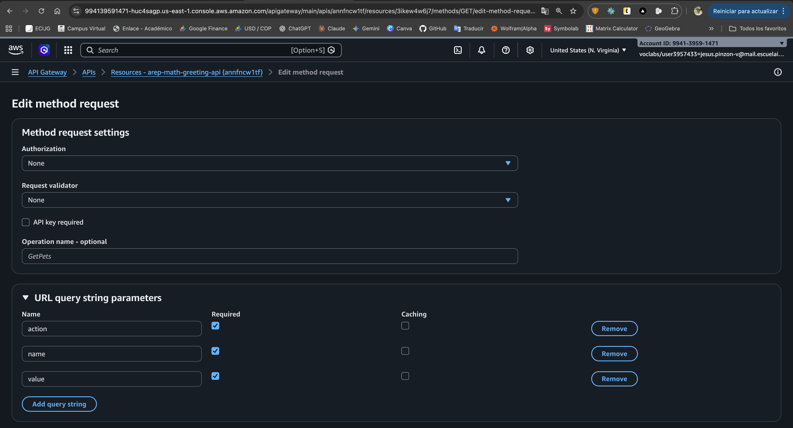

*Method request editor showing the three registered query string parameters*

### Step 5 — Configure GET Integration Request Mapping

In the **GET** method → **Integration request**:

- Under **URL query string parameters**, map:
    - `action` → `method.request.querystring.action`
    - `name` → `method.request.querystring.name`
    - `value` → `method.request.querystring.value`
- Under **Mapping templates** → content type `application/json`, use:

```velocity
{
  "action": "$input.params('action')",
  "value": "$input.params('value')",
  "name": "$input.params('name')"
}
```

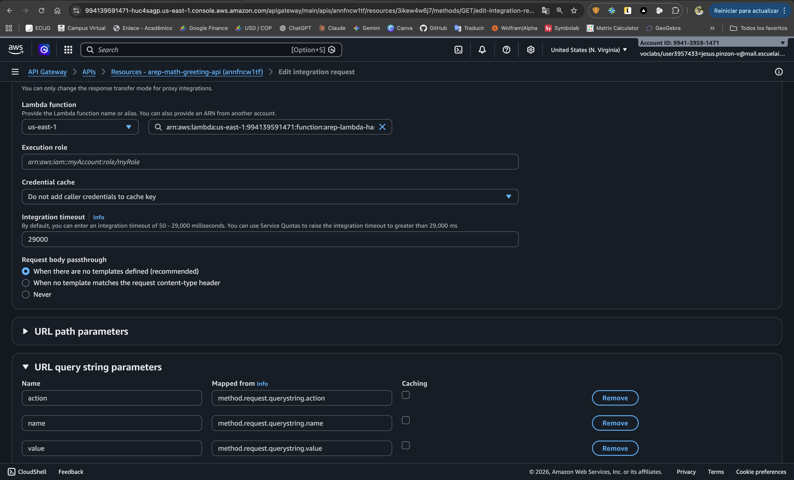

*Integration request showing the three URL query string parameters mapped from method request*

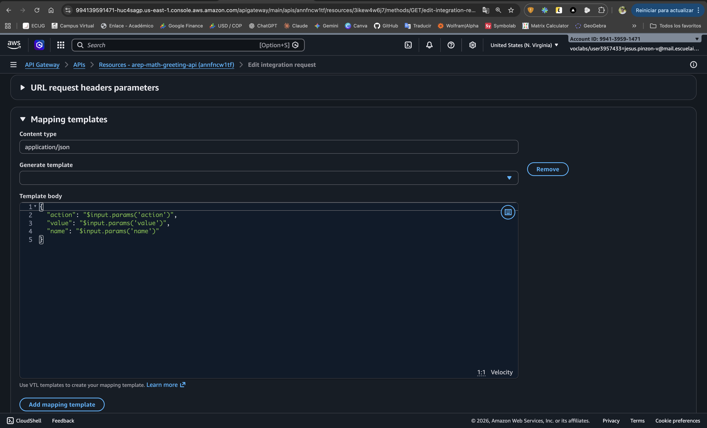

*Velocity mapping template for the GET method extracting query parameters*

### Step 6 — Configure POST Integration Request Mapping

In the **POST `/users`** method → **Integration request** → **Mapping templates** → content type `application/json`, use:

```velocity
{
  "action": "user",
  "name": "$input.path('$.name')",
  "email": "$input.path('$.email')"
}
```

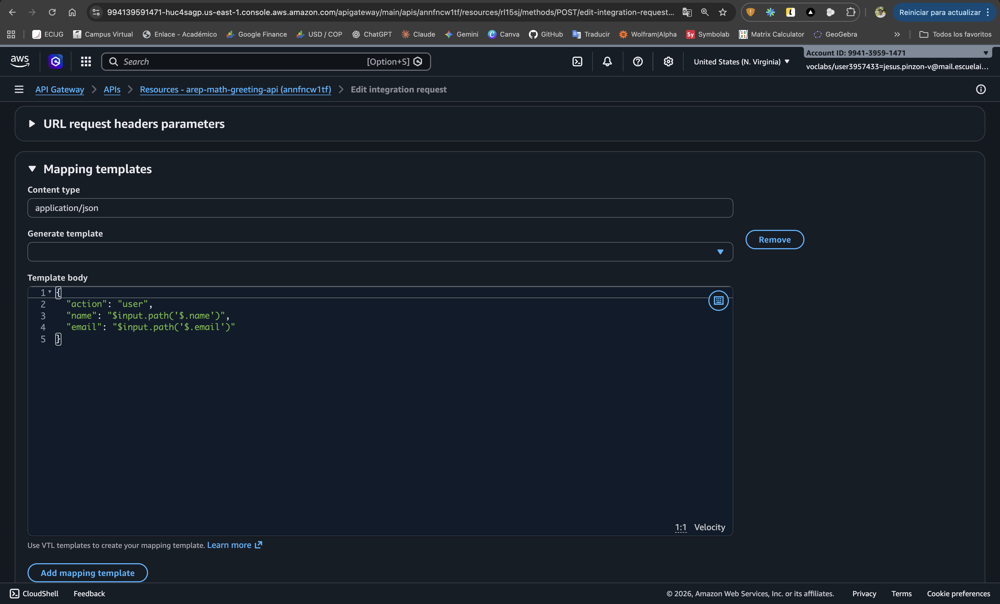

*Velocity mapping template for the POST method extracting body fields*

### Step 7 — Deploy the API

1. Click **Deploy API** → **New Stage**
2. **Stage name:** `production`
3. Click **Deploy**

The **Invoke URL** will follow the pattern:

```
https://{id}.execute-api.us-east-1.amazonaws.com/production
```

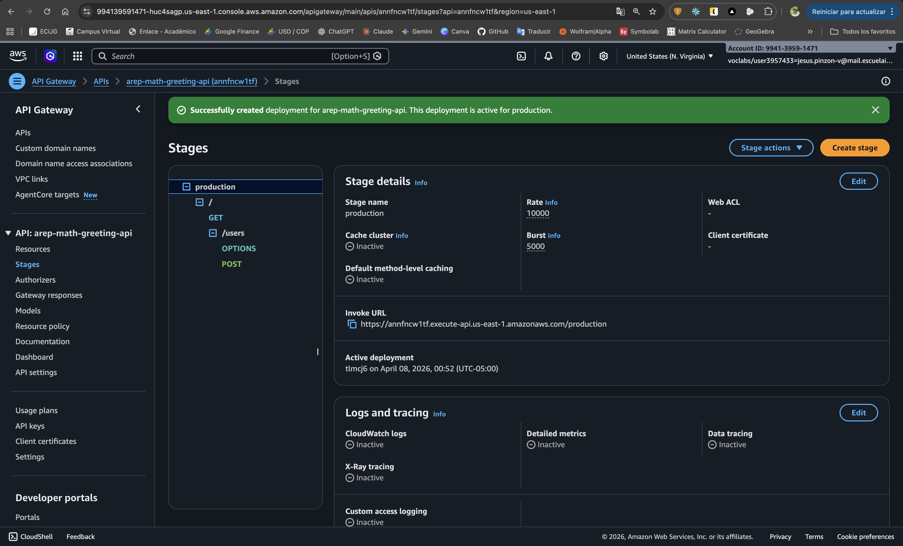

*Production stage editor showing the active Invoke URL and deployment details*

---

## 🧪 **Testing**

### Unit Tests

Unit tests are written with **JUnit 5** and cover all service classes and the Lambda handler routing logic independently of AWS infrastructure.

```bash
mvn test
```

### Integration Testing with Postman

The three endpoints were validated using **Postman** with the collection **AWS Lambda & API Gateway**.

#### GET — Greeting

- **Method:** `GET`
- **URL:** `https://annfncw1tf.execute-api.us-east-1.amazonaws.com/production?action=greet&name=AREP`

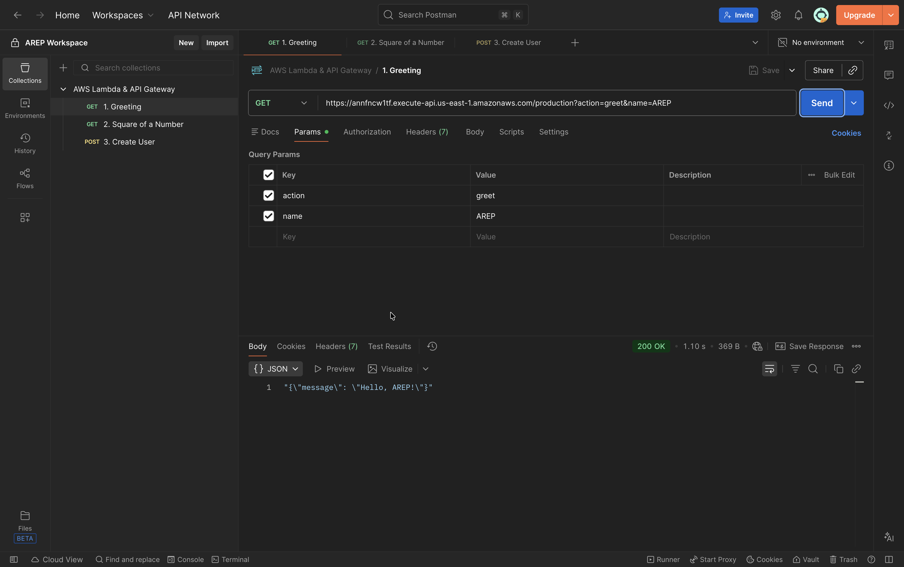

*Postman returning* `{"message": "Hello, AREP!"}` *with HTTP 200 OK*

#### GET — Square of a Number

- **Method:** `GET`
- **URL:** `https://annfncw1tf.execute-api.us-east-1.amazonaws.com/production?action=square&value=5`

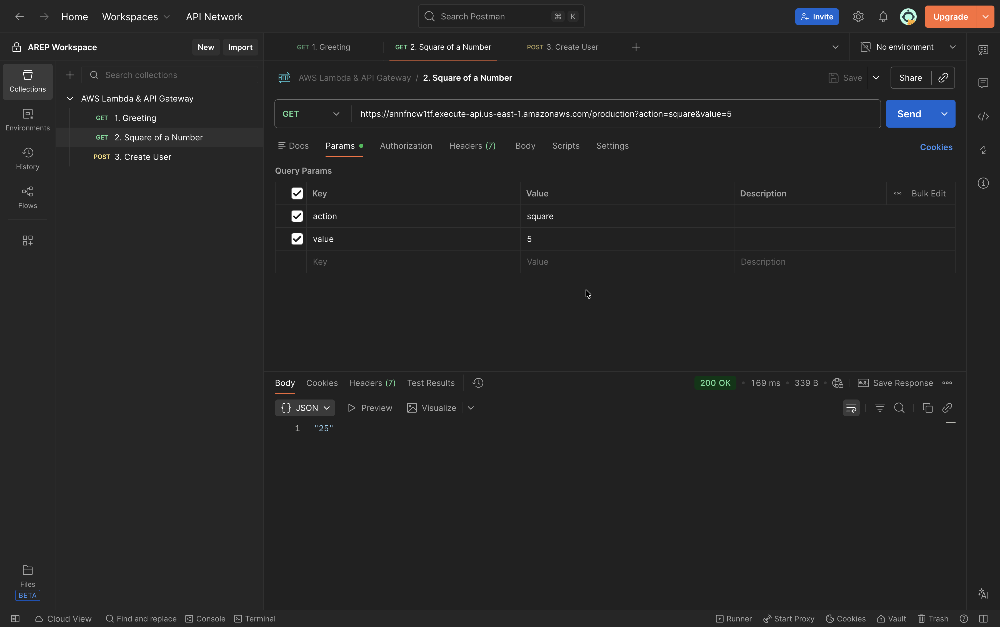

*Postman returning* `25` *for input value* `5` *with HTTP 200 OK*

#### POST — Create User

- **Method:** `POST`
- **URL:** `https://annfncw1tf.execute-api.us-east-1.amazonaws.com/production/users`
- **Headers:** `Content-Type: application/json`
- **Body:**

```json
{
  "name": "Jesús Pinzón",
  "email": "jesus.pinzon-v@mail.escuelaing.edu.co"
}
```

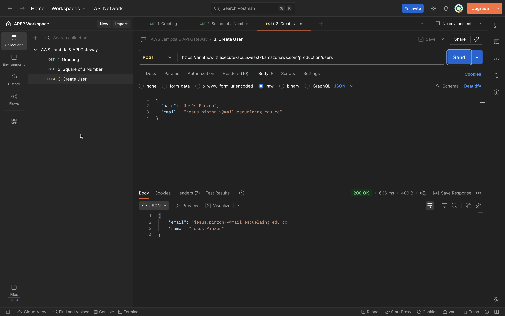

*Postman returning the user JSON object with name and email fields, HTTP 200 OK*

### cURL

```bash
# GET — Greeting
curl "https://annfncw1tf.execute-api.us-east-1.amazonaws.com/production?action=greet&name=Jesús"

# GET — Square
curl "https://annfncw1tf.execute-api.us-east-1.amazonaws.com/production?action=square&value=7"

# POST — Create User
curl -X POST "https://annfncw1tf.execute-api.us-east-1.amazonaws.com/production/users" \
  -H "Content-Type: application/json" \
  -d '{"name": "Jesús Pinzón", "email": "jesus.pinzon-v@mail.escuelaing.edu.co"}'
```

> ⚠️ **Important:** After completing the lab, delete both the Lambda function and the API Gateway to avoid unnecessary AWS charges.

---

## 👥 **Author**

<table>
  <tr>
    <td align="center">
      <a href="https://github.com/JAPV-X2612">
        
        <br />
        <sub><b>Jesús Alfonso Pinzón Vega</b></sub>
      </a>
      <br />
      <sub>Full Stack Developer</sub>
    </td>
  </tr>
</table>

---

## 📄 **License**

This project is licensed under the **Apache License, Version 2.0** — see the [LICENSE](LICENSE) file for details.

---

## 🔗 **Additional Resources**

### AWS Documentation
- [AWS Lambda Developer Guide](https://docs.aws.amazon.com/lambda/latest/dg/welcome.html)
- [AWS API Gateway Developer Guide](https://docs.aws.amazon.com/apigateway/latest/developerguide/welcome.html)
- [API Gateway Mapping Template Reference](https://docs.aws.amazon.com/apigateway/latest/developerguide/api-gateway-mapping-template-reference.html)
- [AWS Lambda Java Runtime](https://docs.aws.amazon.com/lambda/latest/dg/lambda-java.html)
- [AWS Lambda Execution Role](https://docs.aws.amazon.com/lambda/latest/dg/lambda-intro-execution-role.html)

### Java & Maven
- [Maven Shade Plugin](https://maven.apache.org/plugins/maven-shade-plugin/)
- [aws-lambda-java-core](https://github.com/aws/aws-lambda-java-libs/tree/main/aws-lambda-java-core)
- [aws-lambda-java-events](https://github.com/aws/aws-lambda-java-libs/tree/main/aws-lambda-java-events)

### Testing
- [JUnit 5 User Guide](https://junit.org/junit5/docs/current/user-guide/)
- [Postman Documentation](https://learning.postman.com/docs/getting-started/introduction/)

### Architecture & Best Practices
- [AWS Well-Architected Framework — Serverless](https://docs.aws.amazon.com/wellarchitected/latest/serverless-applications-lens/welcome.html)
- [Serverless Microservices Patterns](https://aws.amazon.com/blogs/compute/best-practices-for-organizing-larger-serverless-applications/)